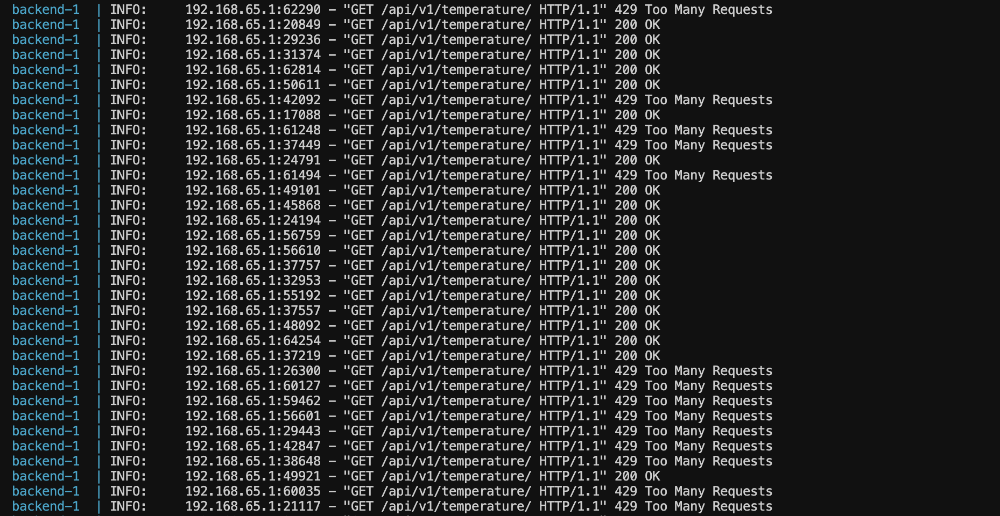

# Welcome to Temperature Dashboard 👋


## Features

- **User Management:**
    - User can signup with email, and password.
    - User can login with email and password.
    - Used **JWT authentication** for authentication security.

- **Temperature Tracking:**
  - User can keep track of the temperature real-time
  
## Run Locally

Clone the project

```bash
  git clone "https://github.com/its-symon/project-temperature.git"
```

Go to the project directory

```bash
  cd project-temperature
```

## Prerequisite
1. Docker


To run the project -

```bash
docker compose up --build
```

For running in detach mode -
```bash
docker compose up --build -d
```

## API Reference

####  Accounts Endpoints:
| HTTP | Endpoints | Action |
| --- | --- | --- |
| **POST** | `/api/v1/auth/login/` | To login a user |
| **POST** | `/api/v1/auth/signup` | To register a user |


####  Temperature Endpoints:
| HTTP | Endpoints | Action |
| --- | --- | --- |
| **POST** | `/api/v1/temperature/` | To create a new temperature (For devloping testing) |
| **GET** | `/api/v1/temperature/` | To retrieve all temperature |
| **Socket** | `/ws/temperature/` | To get the real-time temperature

## Load testing report
### Also provided the CSV file of the testing


## Rate limiting report



## What I did-
### Backend: FastAPI
1. Inserts temperature in both celcius and temperature
2. Added authentication for all the endpoints.
3. Used PostgresSQL as a database
4. Redis is used for check rate limiting
5. Websocket endpoint for the real-time data.
6. Added Cron Jobs to demonstrate real-time data.

### Frontend: React
1. Displays real-time charts using Chart.js
2. Connects to the WebSocket for the live updates.


## Author

👤 **Symon**

- Github: [@sin1ter](https://github.com/its-symon)


